# EmailsVia — Complete Product Documentation

> Cold email that actually lands. Mail merge from your own Gmail with built-in warmup, threaded follow-ups, AI reply triage, and inbox rotation for 10K-row lists.

---

## Table of Contents

1. [Executive Summary](#1-executive-summary)
2. [Product Overview](#2-product-overview)
3. [Pricing & Plans](#3-pricing--plans)
4. [Tech Stack](#4-tech-stack)
5. [System Architecture](#5-system-architecture)
6. [URL Zones & Authentication Model](#6-url-zones--authentication-model)
7. [Database Schema](#7-database-schema)
8. [Core User Flows](#8-core-user-flows)
9. [The Send Loop (`/api/tick`)](#9-the-send-loop-apitick)
10. [Reply Ingestion & AI Triage](#10-reply-ingestion--ai-triage)
11. [Warmup System](#11-warmup-system)
12. [Inbox Rotation](#12-inbox-rotation)
13. [A/B Testing](#13-ab-testing)
14. [Public API & Webhooks](#14-public-api--webhooks)
15. [Admin Operator Surface](#15-admin-operator-surface)
16. [Background Jobs (Supabase pg_cron)](#16-background-jobs-supabase-pg_cron)
17. [Business Analysis](#17-business-analysis)
18. [Marketing Strategy](#18-marketing-strategy)
19. [Go-to-Market Plan](#19-go-to-market-plan)
20. [Roadmap](#20-roadmap)

---

## 1. Executive Summary

**EmailsVia** is a Gmail-native cold-email platform built for solo founders, agencies, and SDRs who need to send personalised outbound campaigns from their own inbox without burning their domain reputation.

It positions directly against **Mailmeteor** (the dominant Gmail mail-merge tool, ~$24.99/mo for warmup) and **Instantly.ai** ($37/mo+) by offering:

- **Warmup included from $9/mo** — competitors charge separately for it
- **Hard-fail merge validation** — never sends "Hey ," when `{{Company}}` is empty
- **Inbox rotation at $39/mo** — split a 10K-row list across 10 Gmails (no competitor at this price-point ships this)
- **AI reply triage** — every reply auto-classified as `interested / not_now / question / ooo / bounce`
- **Public API + webhooks** — embed campaign sending in your own product

**Free forever for 50 sends/day.** No credit card. No trial timer.

The "via" in the name is the wedge: campaigns send **through your own Gmail**. Reputation stays with the user's domain — the way deliverability is supposed to work.

---

## 2. Product Overview

### Who it's for

| Segment | Pain | Why EmailsVia |
|---|---|---|
| Solo founder doing outbound | Mailmeteor's $25/mo warmup feels gouge-y for a side hustle | $9/mo includes warmup |
| Agency SDR | Lists too big for a single Gmail; getting throttled | Inbox rotation across 10 senders |
| YC-style early-stage team | Need API to embed outreach into product | Public API + webhooks |
| Recruiter / BD | Drowning in "thanks" / OOO replies | AI triage filters them |

### Core feature matrix

- **Campaign builder** — Markdown editor, Tiptap WYSIWYG, `{{Name}} {{Company}} {{ai:prompt}}` merge tags
- **Recipient sources** — Google Sheets URL or `.xlsx`/`.csv` upload
- **Strict merge validation** — campaign refuses to send a row if any required tag is empty
- **Send schedule** — per-campaign window (e.g. Mon–Fri 8am–6pm IST), gap between sends, daily cap
- **Threaded follow-ups** — replies thread to original via `In-Reply-To` (Gmail groups them as one conversation)
- **Conditional follow-ups** — "send step 2 only if no reply" / "send step 3 only if intent=question"
- **Open/click tracking** — HMAC-signed pixel + link wrapper
- **Unsubscribe** — one-click footer with HMAC token, suppression list per user
- **AI personalisation** — `{{ai:write a one-liner about their pricing page}}` cached per recipient
- **Reply triage** — Groq / Gemini / Claude Haiku 4.5 classifies inbound replies into 7 intents
- **Warmup** — 14-day ramp from 10/day → 400/day on every paid tier
- **Inbox rotation** — distribute one campaign's sends across N Gmails, sticky-per-recipient
- **A/B testing** — variant array with weights, auto-promote winner after threshold
- **Public API** — `POST /api/v1/campaigns/from-sheet` (key auth, billing-gated)
- **Outbound webhooks** — `reply.received`, `reply.classified`, `recipient.unsubscribed`, `campaign.finished`

---

## 3. Pricing & Plans

| Plan | Daily cap | Senders | Follow-ups | AI | A/B | Rotation | API | Warmup | Price/mo |
|---|---|---|---|---|---|---|---|---|---|
| **Free** | 50 | 1 | ❌ | ❌ | ❌ | ❌ | ❌ | ❌ | $0 |
| **Starter** | 500 | 1 | ✅ | ❌ | ❌ | ❌ | ❌ | ✅ | $9 |
| **Growth** | 1,500 | 3 | ✅ | ✅ | ✅ | ❌ | ❌ | ✅ | $19 |
| **Scale** | 5,000 | 10 | ✅ | ✅ | ✅ | ✅ | ✅ | ✅ | $39 |

**Source of truth:** [src/lib/billing.ts:8-59](src/lib/billing.ts#L8-L59), [supabase/migrations/0004_billing.sql](supabase/migrations/0004_billing.sql)

**Status grace logic:** subscriptions with status `past_due` keep working for a grace window before downgrading to free; `unpaid` / `canceled` immediately drop. `suspended_at` (operator-set) blocks all sending at the cron edge.

---

## 4. Tech Stack

| Layer | Choice | Why |
|---|---|---|
| Framework | Next.js 15.4 App Router | RSC + edge middleware in one repo |
| Hosting | Vercel | Zero-ops, free tier covers hobby usage |
| DB / Auth | Supabase (Postgres + RLS) | Multi-tenant isolation via RLS, free tier sufficient at MVP |
| Cron | Supabase pg_cron | Vercel Hobby cron limited to 1/day; pg_cron lets us run 1/min |
| Mail send (oauth) | Gmail API via `googleapis` | First-party, no SMTP throttling |
| Mail send (app pw) | `nodemailer` SMTP | Fallback when org policy blocks OAuth |
| Inbound | Gmail API + ImapFlow | OAuth users use API; app-pw users use IMAP |
| Mime parse | `mailparser` | Reliable header + body extraction |
| Payments | Stripe | Industry standard |
| Transactional | Postmark (optional) | Sender-disconnected + payment-failed emails |
| AI | Groq / Gemini / Claude | Auto-detect cheapest configured provider |
| Errors | Sentry | Cloud monitoring |
| Editor | Tiptap | Markdown <-> HTML round-trip |
| Sheets | `googleapis` Sheets API | Live preview + import |
| Excel | `xlsx` | Browser-side parse |
| Crypto | Node `crypto` | AES-256-GCM for OAuth tokens |

**React 19, Tailwind 3.4, TypeScript 5.7.** Strict mode on everything.

---

## 5. System Architecture

```mermaid
graph TB
    subgraph Browser
        UI[Next.js App<br/>React 19 + Tailwind]
    end

    subgraph "Vercel (Next.js)"
        MW[Middleware<br/>Zone routing + auth]
        UR[/app/* — User UI/]
        AR[/admin/* — Admin UI/]
        MR[/(marketing)/* — Public/]
        API[/api/* — Server routes/]
    end

    subgraph "Supabase Postgres"
        AUTH[(auth.users)]
        DB[(Application tables<br/>RLS enforced)]
        CRON[pg_cron jobs]
    end

    subgraph "External APIs"
        GMAIL[Gmail API<br/>send + read]
        IMAP[IMAP fallback]
        SHEETS[Google Sheets API]
        STRIPE[Stripe<br/>checkout + webhook]
        AI[Groq / Gemini / Claude]
        POSTMARK[Postmark<br/>transactional]
        SENTRY[Sentry]
    end

    UI --> MW
    MW --> UR
    MW --> AR
    MW --> MR
    UI --> API

    API --> DB
    API --> AUTH
    API --> GMAIL
    API --> IMAP
    API --> SHEETS
    API --> STRIPE
    API --> AI
    API --> POSTMARK
    API --> SENTRY

    CRON -->|HTTP w/ bearer| API
    STRIPE -->|webhook| API
    GMAIL -->|OAuth callback| API
```

### Why Supabase pg_cron instead of Vercel cron

Vercel Hobby caps cron at **1 invocation/day**. We need:
- `/api/tick` — 1/min (continuous send loop)
- `/api/check-replies` — every 5 min
- `/api/cron/refresh-tokens` — hourly

Postgres `pg_cron` with `pg_net` extension calls our API endpoints with a bearer token (`CRON_SECRET`). All cron logic lives in [supabase/cron.sql](supabase/cron.sql).

---

## 6. URL Zones & Authentication Model

EmailsVia separates **operator** and **user** UIs at the URL level. An admin account never lands in `/app` — by design — so the two contexts can never mix.

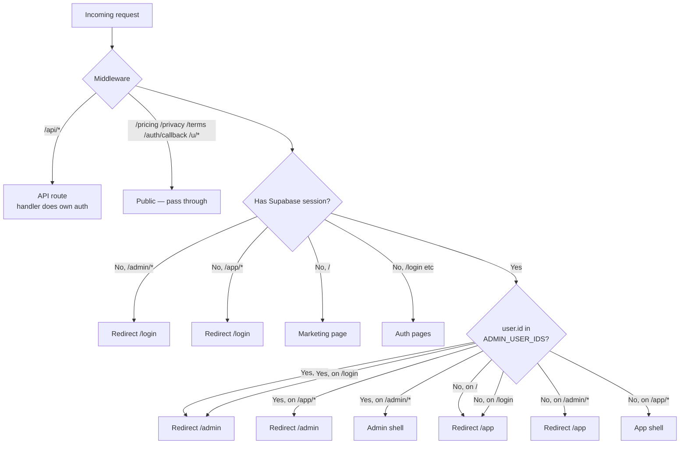

**Zones** ([src/middleware.ts](src/middleware.ts)):

| Zone | Who | What |
|---|---|---|
| `/` | Public + signed-out | Marketing landing |
| `/pricing /privacy /terms` | Always public | SEO + legal + Google OAuth verification |
| `/login /signup /forgot` | Signed-out only | Auth surface |
| `/app/*` | Authenticated non-admin | Product UI |
| `/admin/*` | Authenticated admin (id in `ADMIN_USER_IDS`) | Operator surface |
| `/auth/callback` | Always public | Supabase + Google OAuth return target |
| `/u/[token]` | Always public | One-click unsubscribe landing |
| `/api/*` | Bypasses middleware | Each handler enforces its own auth |

**Admin determination is in-process** — checks `ADMIN_USER_IDS` env var (comma-separated UUIDs). No DB query in the hot path.

---

## 7. Database Schema

19 tables across 14 migrations. Multi-tenancy enforced by `user_id` columns + Postgres RLS.

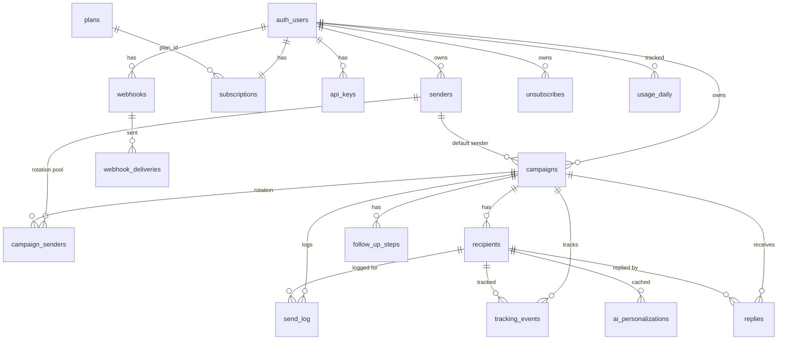

### Key tables

- **`senders`** — connected Gmail mailboxes (OAuth or app-password). `oauth_status` = `ok | revoked | pending`. Encrypted refresh + access tokens.
- **`campaigns`** — campaign definition (subject, template, schedule, daily_cap, gap_seconds, window_start_hour, window_end_hour, timezone, tracking_enabled, follow_ups_enabled, strict_merge, variants).
- **`recipients`** — one row per address. Status lifecycle: `pending → sent → replied | unsubscribed | bounced | failed`. Stores `message_id` (RFC 5322 header) for reply correlation, `sender_id` (sticky in rotation), `variant_id` (A/B).
- **`follow_up_steps`** — sequence of follow-ups. Each has `delay_days`, `subject`, `template`, optional `condition` (`{type: "always" | "no_reply" | "intent_in" | "intent_not_in", intents: [...]}`).
- **`send_log`** — every send attempt (success or fail). `error_class` taxonomy: `auth_revoked | smtp_timeout | rate_limit | bounce_permanent | bounce_temporary | other`.
- **`tracking_events`** — `kind: open | click`. URL + user-agent.
- **`replies`** — inbound mail with AI-classified `intent` + `intent_confidence`.
- **`unsubscribes`** — per-(user_id, email) suppression list.
- **`subscriptions`** — Stripe subscription state. `suspended_at` (operator override) blocks sends.
- **`plans`** — `free | starter | growth | scale`. `daily_cap`, `sender_limit`, `monthly_price_cents`, `features` (jsonb).
- **`usage_daily`** — atomic per-day counter `(user_id, day) → sent`.
- **`campaign_senders`** — rotation pool (campaign_id, sender_id, weight).
- **`tick_locks`** — distributed lock for cron fan-out (`/api/tick` 75s lease).
- **`api_keys`** — SHA-256 hashed personal access tokens (prefix `eav_live_…`).
- **`webhooks`** + **`webhook_deliveries`** — outbound webhooks with HMAC-SHA256 signing.
- **`ai_personalizations`** — cache of `{{ai:…}}` outputs keyed by `(recipient_id, tag, prompt_hash)`.
- **`processed_stripe_events`** — Stripe webhook idempotency.
- **`admin_audit`** — every operator action (plan change, suspend, etc).

---

## 8. Core User Flows

### 8.1 Signup → connected sender → first campaign

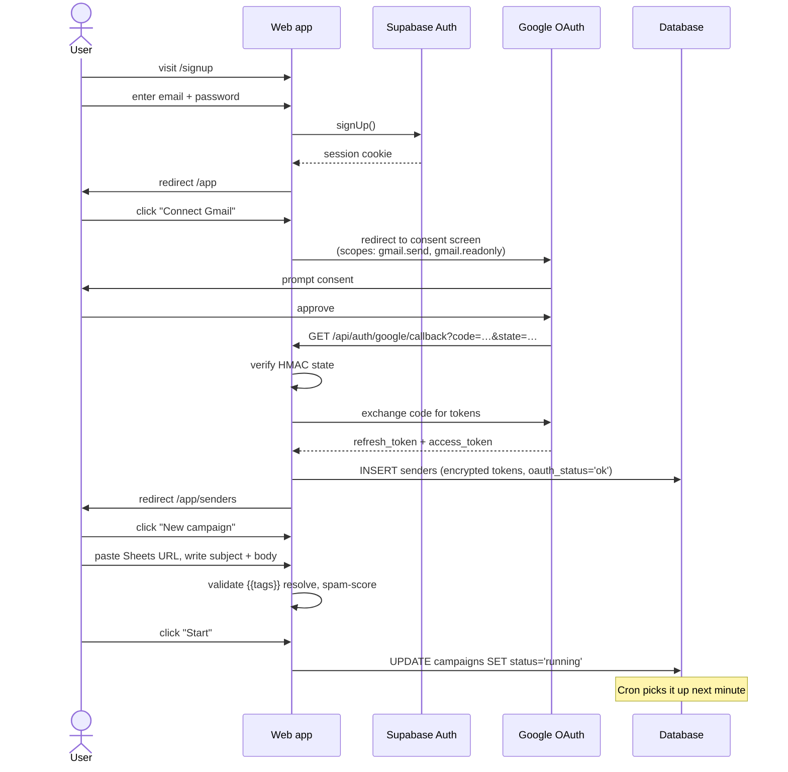

### 8.2 Sender connection state machine

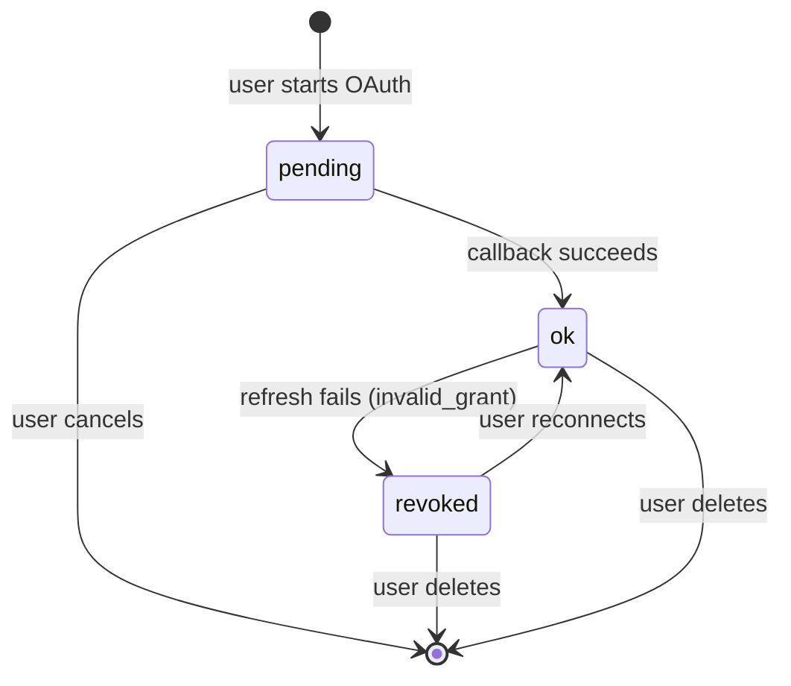

When a sender flips to `revoked`, [src/lib/sender-revoke.ts](src/lib/sender-revoke.ts) sends a one-time Postmark email to the user (if configured) and surfaces an in-app banner via [src/components/AppAlerts.tsx](src/components/AppAlerts.tsx).

### 8.3 Recipient lifecycle

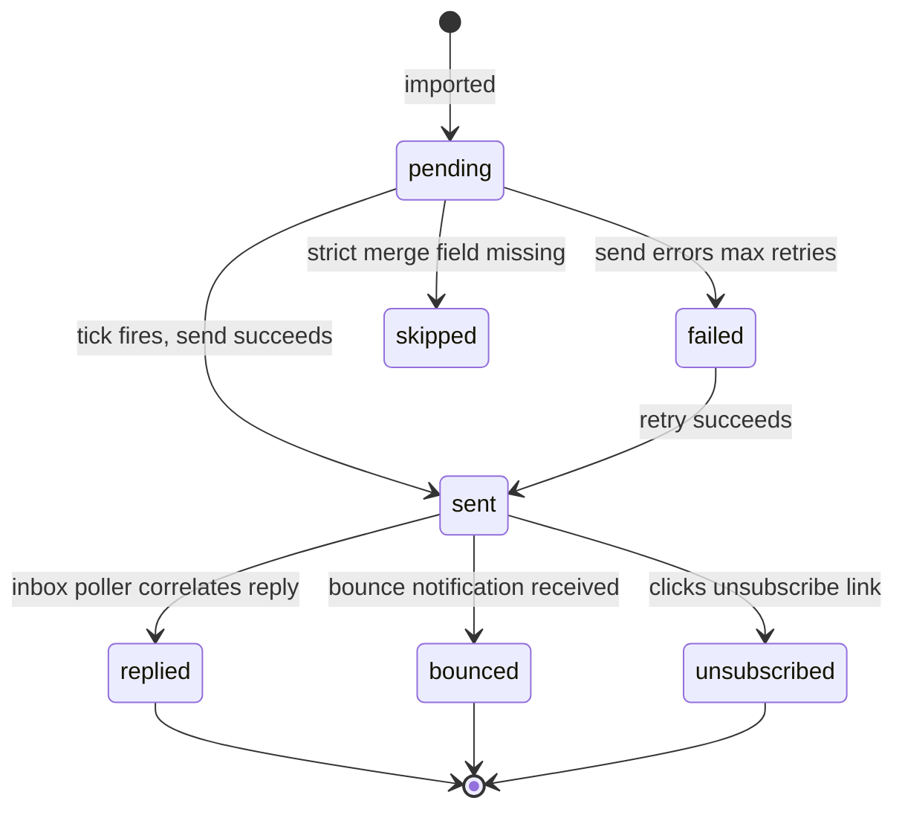

---

## 9. The Send Loop (`/api/tick`)

Single-threaded, fairness-aware. One recipient sent per tick. Cron runs every minute via Supabase pg_cron.

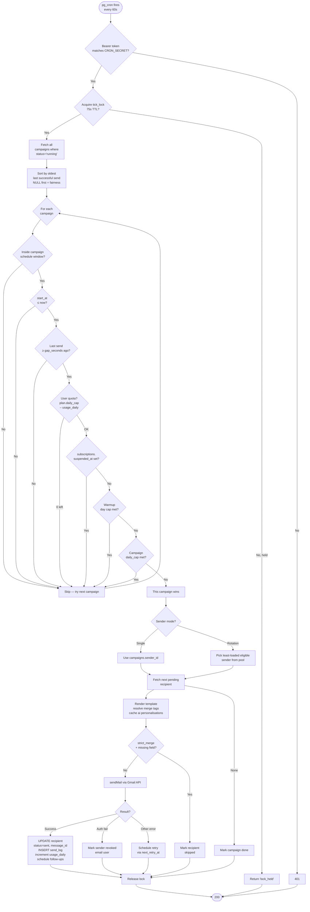

**Why one send per tick?** It bounds blast radius. If a single send hangs or fails, the lock releases in 75s and the next tick retries. No worker pool to manage.

**Fairness:** Campaigns are sorted by oldest-last-send so a high-volume campaign can't starve a low-volume one. The first campaign passing all gates wins the tick.

**Retry / backoff** — failed sends are classified by [src/lib/errors.ts](src/lib/errors.ts) into a coarse taxonomy. Transient errors (`smtp_timeout`, `rate_limit`) are retried up to `max_retries` with exponential backoff. Permanent errors (`bounce_permanent`, `auth_revoked`) are not retried.

---

## 10. Reply Ingestion & AI Triage

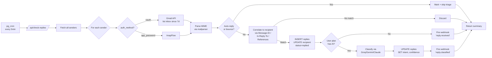

### AI provider abstraction

[src/lib/ai-provider.ts](src/lib/ai-provider.ts) auto-detects the cheapest provider whose key is present:

1. Explicit `AI_PROVIDER` env (if set AND its key exists)
2. Otherwise: `GROQ_API_KEY` > `GEMINI_API_KEY` > `ANTHROPIC_API_KEY`

| Provider | Triage model | Generate model | ~Cost / 1M tokens |
|---|---|---|---|
| Groq | `llama-3.1-8b-instant` | `llama-3.3-70b-versatile` | $0.05 / $0.59 |
| Gemini | `gemini-2.5-flash` | `gemini-2.5-flash` | $0.075 / $0.30 |
| Anthropic | `claude-haiku-4-5` | `claude-haiku-4-5` | $1 / $5 |

A 50K-reply month on Groq costs ~$2. On Claude Haiku it's ~$50. Same UX. We default to whichever is configured.

### Intent classes

[src/lib/triage.ts](src/lib/triage.ts) classifies into 7 labels:

| Intent | Meaning |
|---|---|
| `interested` | Buying signal — wants info, demo, scheduling |
| `not_now` | Polite decline — "we already use X" |
| `question` | Substantive technical question |
| `unsubscribe` | "remove me", "stop" |
| `ooo` | Auto-vacation reply |
| `bounce` | Mailer-daemon, undeliverable |
| `other` | Spam, off-topic, single-word |

Returns `{intent, confidence: 0..1}`. Confidence < 0.4 → typically falls back to `other`.

The system prompt is stable (~1.5K tokens) for prompt-cache hits across replies.

---

## 11. Warmup System

[src/lib/warmup.ts](src/lib/warmup.ts) implements a conservative 14-day ramp:

| Day | Cap |
|---|---|
| 1 | 10 |
| 2 | 20 |
| 3 | 40 |
| 4 | 60 |
| 5 | 100 |
| 6 | 150 |
| 7 | 200 |
| 8 | 250 |
| 9 | 300 |
| 10 | 350 |
| 11–14 | 400 |
| 15+ | ∞ (no cap) |

Effective send limit per tick = `min(plan.daily_cap, campaign.daily_cap, warmup_cap_for_sender(sender, now))`.

Warmup is **opt-in per sender** (`senders.warmup_enabled = true`). Brand-new Gmails or domains in poor reputation should opt in. Established mailboxes don't need it.

---

## 12. Inbox Rotation

Scale plan only. Spread one campaign's volume across multiple Gmails.

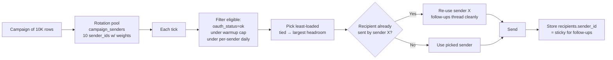

**Sticky-per-recipient** is critical: follow-ups must come from the same Gmail as the initial send, otherwise In-Reply-To threading breaks and the prospect sees three new threads instead of a conversation.

---

## 13. A/B Testing

Growth + Scale. [src/lib/variants.ts](src/lib/variants.ts).

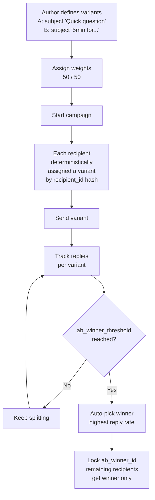

User can also manually `POST /api/campaigns/[id]/promote-winner`.

---

## 14. Public API & Webhooks

### Public API (Scale plan)

API keys are SHA-256 hashed, prefix shown once at creation: `eav_live_…`.

**`POST /api/v1/campaigns/from-sheet`** — create + start a campaign from a Google Sheet in one call.

```http
Authorization: Bearer eav_live_abc123…
Content-Type: application/json

{
  "name": "Q2 outreach batch 4",
  "subject": "Quick question about {{Company}}",
  "template": "Hi {{Name}},\n\n…",
  "sheet_url": "https://docs.google.com/spreadsheets/d/.../",
  "sender_id": "uuid",
  "schedule": { "daily_cap": 1000, "gap_seconds": 60 }
}
```

Returns campaign id and status. Useful for embedding outreach into a CRM, lead-gen agent, or product onboarding.

### Webhooks

Users register URL + secret. Events fire HMAC-SHA256 signed POST. Stored in `webhook_deliveries`.

| Event | Payload |
|---|---|
| `reply.received` | reply id, recipient, body |
| `reply.classified` | reply id, intent, confidence |
| `recipient.unsubscribed` | recipient id, email |
| `campaign.finished` | campaign id, totals |

---

## 15. Admin Operator Surface

`/admin/*` is gated by `ADMIN_USER_IDS` env (comma-separated UUIDs). Admins **never** land in `/app` — middleware redirects them to `/admin`. This is intentional: operator and tenant contexts must not mix.

Pages:

| Route | Purpose |
|---|---|
| `/admin` | MRR, paying users, error rates, 30d charts |
| `/admin/users` | Cross-tenant user list, search, filter |
| `/admin/users/[id]` | Single user — force plan change, suspend |
| `/admin/campaigns` | Cross-tenant campaign list |
| `/admin/senders` | All connected senders (debugging OAuth) |
| `/admin/replies` | Cross-tenant reply audit |
| `/admin/billing` | Stripe state per user |
| `/admin/webhooks` | Webhook delivery log |
| `/admin/system` | Cron status, AI provider, version |

Every operator action writes to `admin_audit`.

---

## 16. Background Jobs (Supabase pg_cron)

[supabase/cron.sql](supabase/cron.sql)

```mermaid
gantt
    title Cron schedule
    dateFormat HH:mm
    axisFormat %H:%M
    section tick
    /api/tick                :every1m, 00:00, 1h
    section replies
    /api/check-replies       :every5m, 00:00, 1h
    section tokens
    /api/cron/refresh-tokens :every1h, 00:00, 6h
```

Each job uses `pg_net.http_post` with `Authorization: Bearer ${CRON_SECRET}`. The route handlers verify the bearer via [src/lib/tokens.ts](src/lib/tokens.ts) `cronBearerOk()`.

---

## 17. Business Analysis

### 17.1 Market

Cold outbound is a **$3-5B+ market** in 2026, growing as more startups go founder-led on outbound. Three sub-markets:

1. **Mail-merge tools** (Mailmeteor, GMass, YAMM) — Gmail extensions, mid-market
2. **Cold-email platforms** (Instantly, Smartlead, Lemlist) — own infrastructure, agency-priced ($37-$199/mo)
3. **Sales engagement** (Outreach, Salesloft, Apollo) — enterprise, $100+/seat/mo

EmailsVia sits in market 1's distribution but with market 2's feature depth — at half the price.

### 17.2 Competitive landscape

| Competitor | Pricing | Sender model | Warmup | AI triage | Inbox rotation | Public API |
|---|---|---|---|---|---|---|
| **Mailmeteor** | $9.99-49.99/mo | User's Gmail | $24.99/mo add-on | ❌ | ❌ | ❌ |
| **GMass** | $19.95-49.95/mo | User's Gmail | Add-on | ❌ | ❌ | ❌ |
| **Instantly** | $37-358/mo | Their infra | ✅ | ✅ | ✅ | ✅ |
| **Smartlead** | $39-94/mo | Their infra | ✅ | ✅ | ✅ | ✅ |
| **Lemlist** | $39-99/mo | Their infra | ✅ | ✅ | ❌ | ✅ |
| **EmailsVia** | $0-39/mo | **User's Gmail** | ✅ included | ✅ | ✅ at $39 | ✅ at $39 |

### 17.3 Why "via your Gmail" matters

Cold-email platforms that send from their own infrastructure suffer **shared-IP reputation collapse** when other tenants spam. EmailsVia's design avoids this entirely — every send leaves from the user's own Gmail with their own sender reputation.

This is the same wedge Mailmeteor used to beat sales-engagement giants in the SMB segment. We extend it with platform features SMB tools historically didn't ship.

### 17.4 Unit economics

Per Scale ($39/mo) customer at break-even:

| Cost | Per-customer/month |
|---|---|
| Supabase row storage (~5K recipients × 10 campaigns) | ~$0.10 |
| Supabase egress + cron CPU | ~$0.20 |
| Vercel function invocations (cron + UI) | ~$0.30 |
| AI triage (assume 500 replies/mo on Groq) | ~$0.05 |
| Stripe fee (2.9% + $0.30) | $1.43 |
| Sentry / Postmark | ~$0.10 |
| **Total COGS** | **~$2.20** |
| **Gross margin** | **94.4%** |

Even at Starter ($9), gross margin is ~85% because COGS scales with sends, not seats.

### 17.5 LTV / CAC targets

- **Target CAC**: $30-60 (organic + content-led)
- **Average plan**: $19 (Growth) — anchor pricing pushes self-serve toward middle tier
- **Churn assumption**: 5%/mo (typical SMB SaaS)
- **LTV** ≈ $19 × 0.85 / 0.05 = **$323**
- **LTV:CAC** = 5-10x → very healthy if marketing stays organic

### 17.6 Risks & mitigations

| Risk | Mitigation |
|---|---|
| Google revokes OAuth scopes for our app | Multi-channel (app-password fallback in code), CASA security review queued |
| Spam from one tenant gets all of EmailsVia flagged | We don't send from our IPs — each user's Gmail is isolated |
| Stripe / Supabase outage | Graceful degrade (read-only mode, banner) |
| Mailmeteor / Instantly drop prices | Our $9 tier already undercuts everyone with warmup; race-to-bottom favours us |
| Apple Mail Privacy auto-opens pixels (skews open-rate) | We surface clicks + replies as primary metrics |

---

## 18. Marketing Strategy

### 18.1 Positioning

> **"Mailmeteor with cold-outreach DNA."**

Targets users who already searched "Mailmeteor warmup", "Mailmeteor alternative", "GMass vs Mailmeteor". They know mail-merge from Gmail; they want platform features without paying enterprise prices.

### 18.2 Three-message wedge

Every landing page section, ad, and tweet works one of three angles:

1. **"Warmup at $9 — Mailmeteor charges $25"** (price wedge)
2. **"Never sends 'Hey ,' again"** (quality wedge — strict merge)
3. **"Inbox rotation at $39"** (capability wedge — no SMB competitor ships this)

### 18.3 Channels

| Channel | Tactic | Cost |
|---|---|---|
| **SEO** | "Mailmeteor alternative", "mail merge with warmup", "cold email from Gmail" | $0 + content time |
| **Reddit** | r/sales, r/Entrepreneur, r/coldemail — answer threads, don't shill | $0 |
| **X / LinkedIn** | Founder build-in-public, weekly screenshots of metrics | $0 |
| **Product Hunt** | Launch Day 1 of public release; tier targeted at $9 lifetime deal for first 100 | $0 |
| **Comparison pages** | `/compare/mailmeteor`, `/compare/gmass`, `/compare/instantly` | $0 |
| **Affiliate / partner** | 30% recurring for first 12 months | Variable |
| **Targeted ads** | Google "mailmeteor pricing" intent kw | $200/mo budget cap |

### 18.4 Content pillars

- **"Cold email deliverability" guides** (warmup, SPF/DKIM/DMARC, list hygiene)
- **"Stop sending broken merges"** — case study of strict-merge feature
- **Tear-downs** of competitor pricing pages (highly clickable)
- **Open-source mini-tools** — free spam-score checker, free email-syntax checker (drives signups)

### 18.5 Onboarding hook

Free tier is **forever-free at 50/day**. Not a 14-day trial. This:
- Reduces signup friction (no card)
- Creates word-of-mouth — users tell friends "I use this for free"
- Converts when they hit 50/day and need 500 — clear, painful upgrade trigger

### 18.6 Growth model

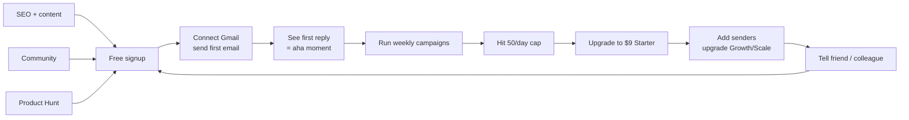

---

## 19. Go-to-Market Plan

### Week 1-2 (post-launch)
- Ship landing page + pricing
- Submit to 5 SaaS directories (Product Hunt, Indie Hackers, BetaList, SaaSHub, AlternativeTo)
- Write 3 comparison pages: vs Mailmeteor, vs GMass, vs Instantly
- DM 50 founders who tweeted "cold email" recently

### Month 1
- Launch on Product Hunt (Tuesday, 12:01am PST)
- Offer 100 lifetime $19/mo deals to PH supporters
- Collect testimonials, post to landing page
- Start an "outbound deliverability" newsletter — 1 issue/week

### Month 2-3
- Begin SEO content sprint — 8 articles targeting long-tail kw ("how to warm up a Gmail for cold email", "mailmeteor vs gmass 2026", etc.)
- Open API beta — invite YC + Gumroad-tier devs to embed
- First affiliate partnership — sales coach / SDR community

### Month 4-6
- Goal: $5K MRR
- Add Slack-app integration ("send campaign from Slack slash command")
- Add Zapier integration (for non-API users)
- Translate landing page to es / pt-br (LATAM SDR market is huge + underserved)

### Month 7-12
- Goal: $25K MRR
- Hire 1 part-time content writer
- Open paid Google Ads on competitor brand kw (must be careful — Google may block)
- Launch enterprise tier (custom domains, SSO, audit log) for $199/mo

---

## 20. Roadmap

### Shipped (MVP)
- ✅ Free + paid tiers
- ✅ Gmail OAuth + app-password senders
- ✅ Campaign builder, follow-ups, A/B
- ✅ Strict merge validation
- ✅ Open/click tracking, unsubscribe
- ✅ AI personalisation + reply triage
- ✅ Warmup
- ✅ Inbox rotation
- ✅ Public API + webhooks
- ✅ Admin operator surface
- ✅ Stripe checkout + portal
- ✅ Sentry + in-app alerts banner

### Next quarter
- [ ] SPF/DKIM/DMARC checker (free tool, signup magnet)
- [ ] Lead enrichment integration (Apollo, Clearbit) for `{{ai:…}}` context
- [ ] Outlook OAuth (parallel to Gmail)
- [ ] Calendar slot links (auto-Cal.com / SavvyCal)
- [ ] Slack notification on `interested` reply
- [ ] Zapier app

### 6-12 months
- [ ] Enterprise tier — custom domains, SSO, audit log
- [ ] Multi-step deliverability dashboard (per-sender bounce rate, complaint rate)
- [ ] Sequence library / templates marketplace
- [ ] Browser extension — turn LinkedIn profile into recipient

---

## Appendix A — Environment variables

| Var | Purpose | Required |
|---|---|---|
| `SUPABASE_URL` | Supabase project URL | Yes |
| `SUPABASE_ANON_KEY` | Public anon JWT key | Yes |
| `SUPABASE_SERVICE_ROLE_KEY` | Service role key (bypasses RLS) | Yes |
| `GOOGLE_OAUTH_CLIENT_ID` / `_SECRET` | OAuth for sender connect | Yes |
| `ENCRYPTION_SECRET` | AES-256-GCM key (hex 32B) | Yes |
| `SESSION_SECRET` | HMAC for OAuth state / unsubscribe | Yes |
| `CRON_SECRET` | Bearer token for pg_cron jobs | Yes |
| `STRIPE_SECRET_KEY` / `_WEBHOOK_SECRET` | Stripe | Yes |
| `STRIPE_PRICE_STARTER/GROWTH/SCALE` | Stripe price IDs | Yes |
| `ADMIN_USER_IDS` | Comma-separated operator user UUIDs | Yes |
| `APP_URL` | Public origin (https://emailsvia.com) | Yes |
| `NEXT_PUBLIC_SENTRY_DSN` etc. | Sentry | Yes |
| `GROQ_API_KEY` / `GEMINI_API_KEY` / `ANTHROPIC_API_KEY` | AI provider (any one) | One required for AI features |
| `POSTMARK_SERVER_TOKEN` etc. | Optional transactional email | No (in-app banner fallback) |

---

## Appendix B — File map

```
src/
├── middleware.ts                # zone routing
├── app/
│   ├── (marketing)/             # /, /pricing, /privacy, /terms
│   ├── (auth)/                  # /login, /signup, /forgot
│   ├── auth/callback/           # OAuth return
│   ├── u/[token]/               # unsubscribe landing
│   ├── app/                     # /app/* — user shell
│   ├── admin/                   # /admin/* — operator shell
│   └── api/                     # 57 routes
├── components/
│   ├── AppShell.tsx
│   ├── AdminShell.tsx
│   ├── AppAlerts.tsx            # in-app ops banners
│   ├── CampaignForm.tsx
│   └── …
└── lib/                         # 31 modules
    ├── billing.ts               # plan logic, gate fn
    ├── ai-provider.ts           # Groq/Gemini/Claude
    ├── triage.ts                # reply intent classifier
    ├── warmup.ts                # 14d ramp
    ├── variants.ts              # A/B
    ├── webhooks.ts              # outbound webhooks
    └── …

supabase/
├── migrations/                  # 14 SQL files
└── cron.sql                     # pg_cron job definitions
```

---

*Last updated: 2026-05-06.*
